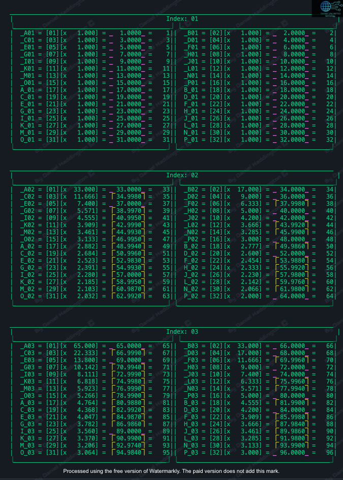
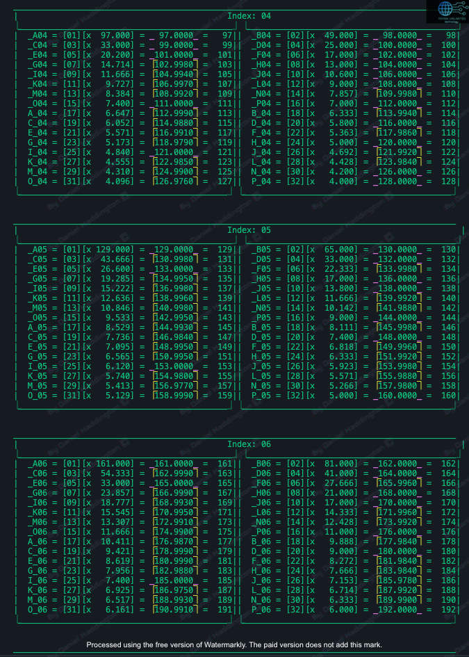
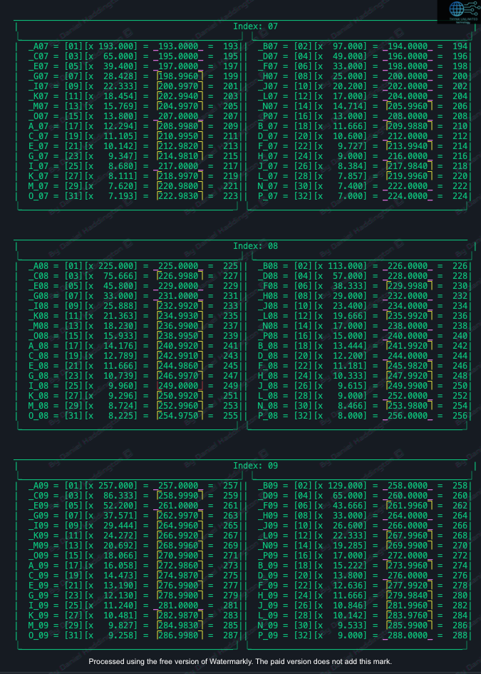
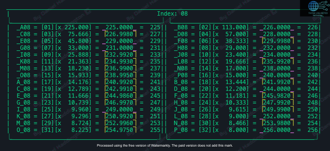
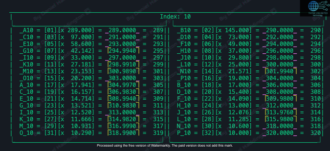
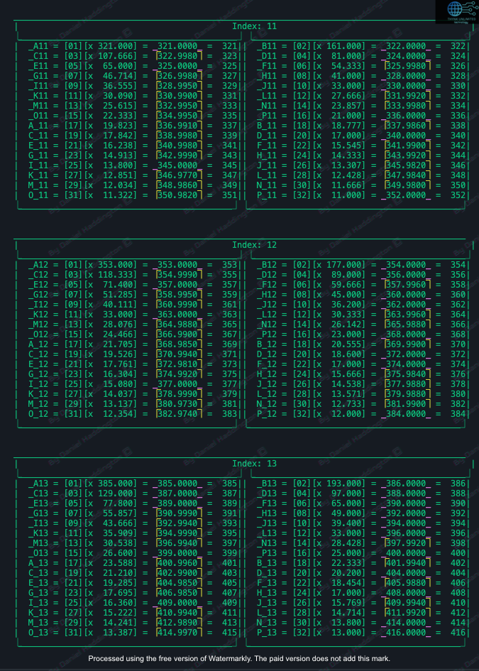
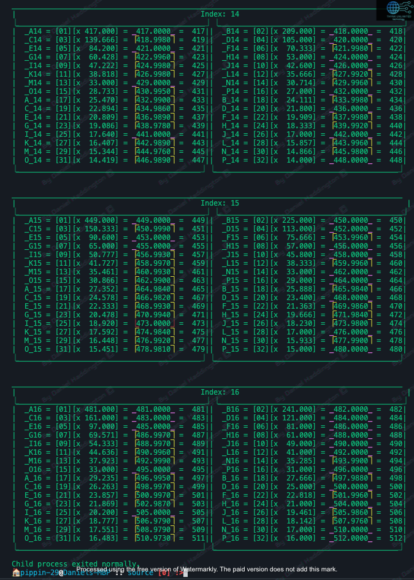

# correcting 'md' number set system

<figure><figcaption></figcaption></figure>

<figure><figcaption></figcaption></figure>

### I\_08 points towards an inconsistency  with my program.

<figure><figcaption></figcaption></figure>

### Edit

The following set for index 8 has been corrected due to a clerical error,\
I was not using the drop\_tail version of the value to be operated on so that it becomes an integer (ceiling function).

The other sets in this page may be unreliable, and so i will keep them here, and the next page will detail the sets with the correct programming implementation.

<figure><figcaption>
Corrected for index 8
</figcaption></figure>

<figure><figcaption></figcaption></figure>

<figure><figcaption></figcaption></figure>

<figure><figcaption></figcaption></figure>
