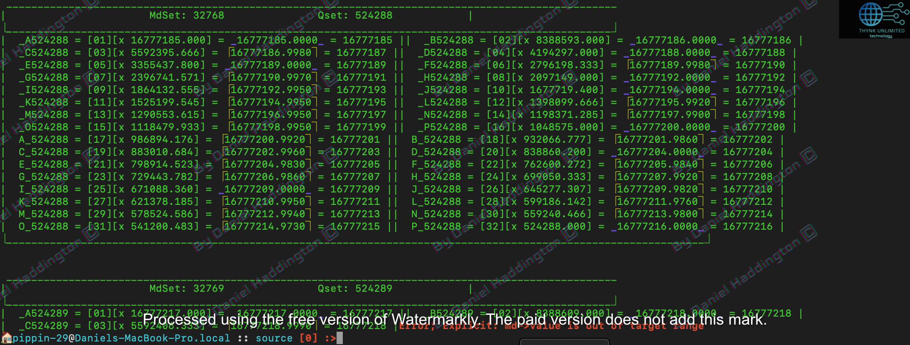
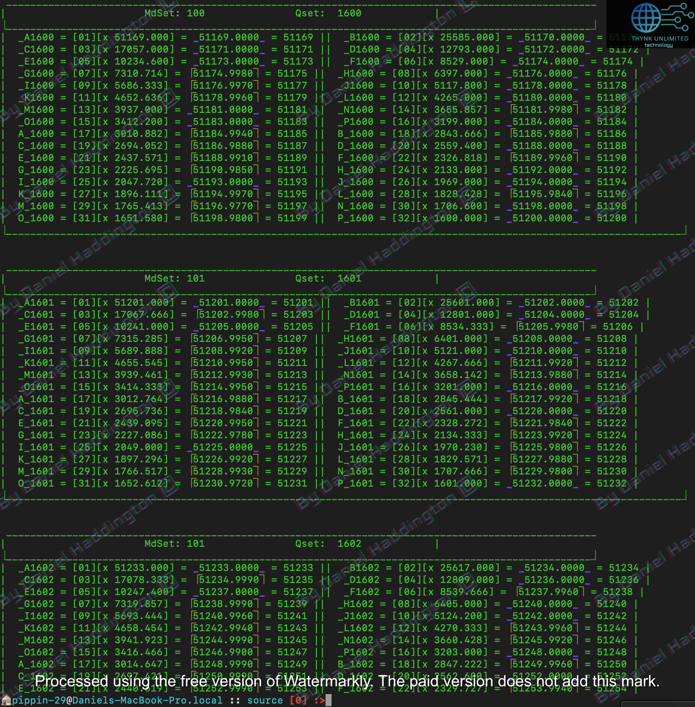

# Imprecision

Could be a problem with the way the computer handles floating-point arithmetic and storage, 8 byte doubles seem to overflow here. \
\_B524289 = 16777218

<figure><figcaption></figcaption></figure>

<figure><figcaption></figcaption></figure>
