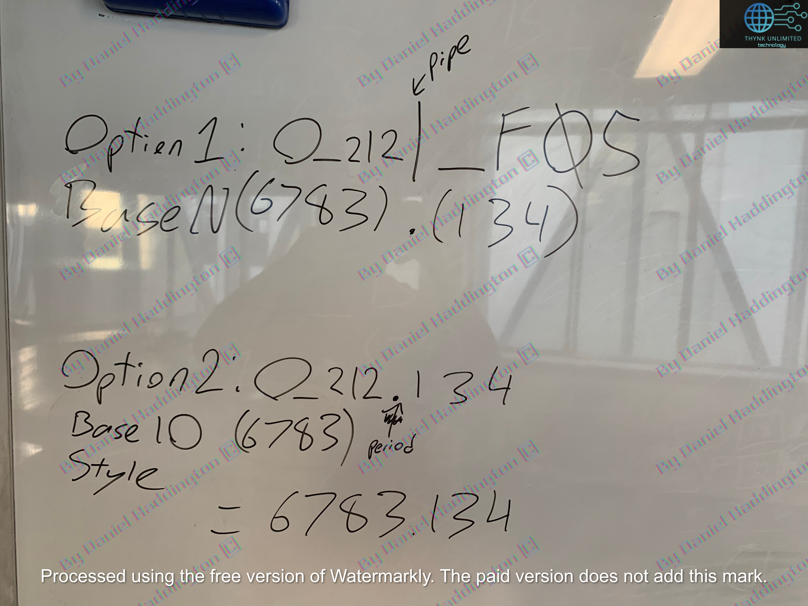

# It\`s Base N!

<figure><figcaption></figcaption></figure>

$$
6783.134    \times 10^3 = 6783134.0
$$

$$
N\_211973 = [30][\times 226104.466] = ⎾6783133.9800⏋ = 6783134
$$

$$
Therefore \\
O\_212 + [N\_211973 - O\_212]|[\_F5 - \_F5] = N\_211973
$$

