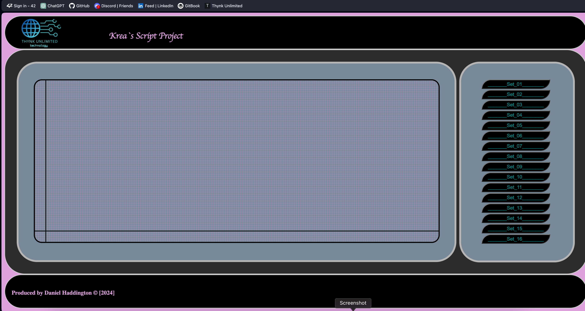
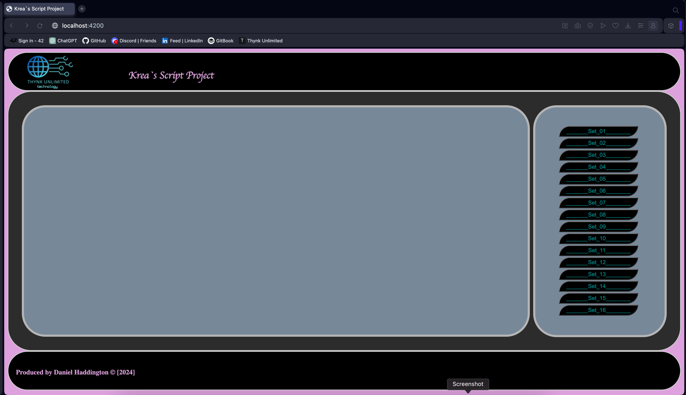
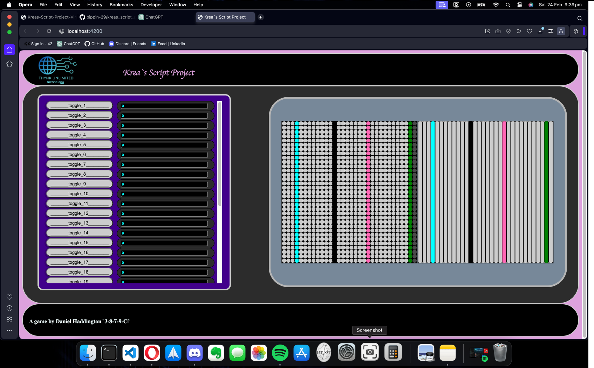
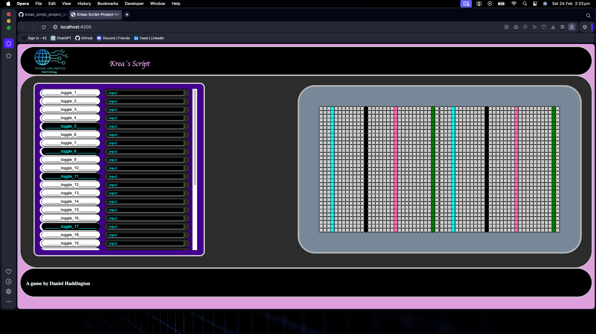
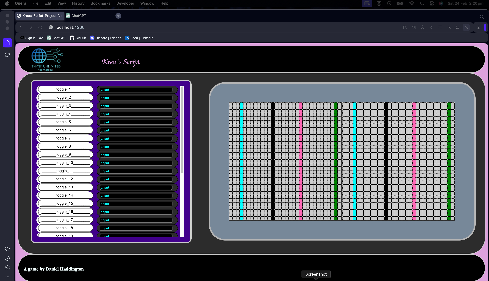
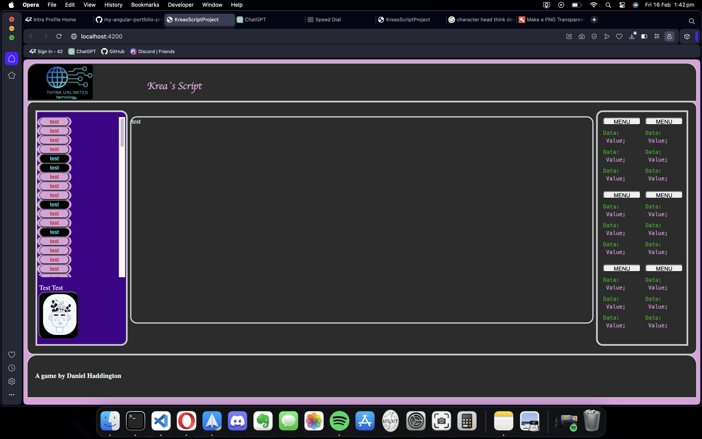
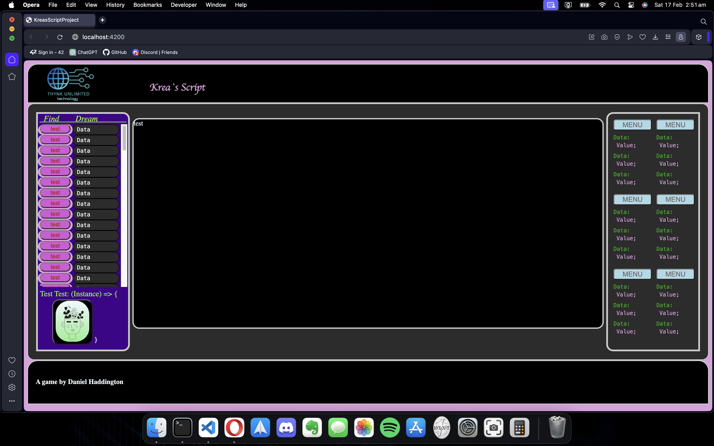
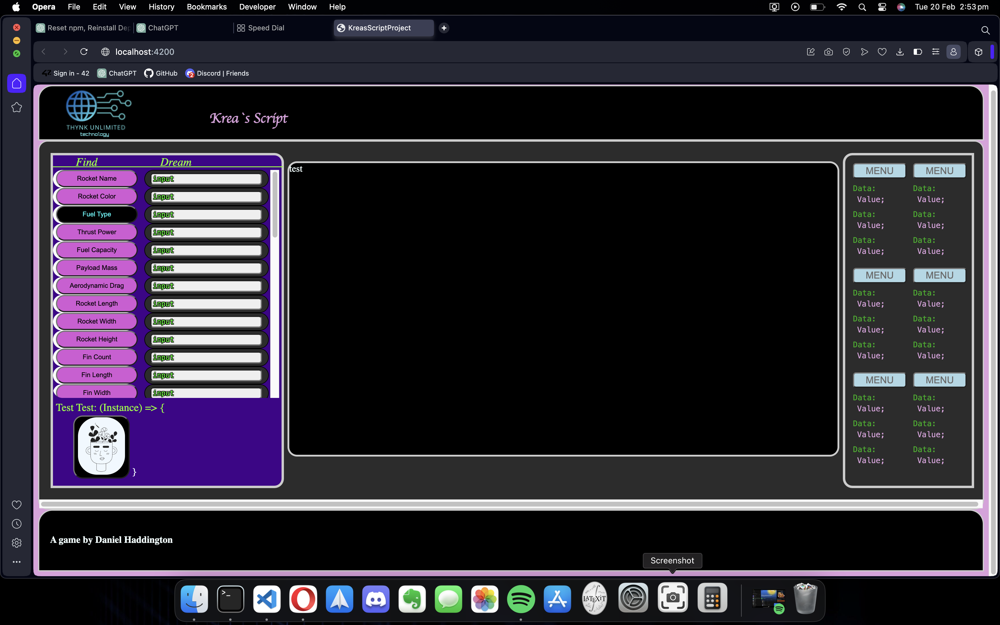

# Screenshots

### \<vine\_3.01>

<figure><figcaption></figcaption></figure>

<figure><figcaption></figcaption></figure>

### \<vine\_2.1>

<figure><figcaption>
Component definition of grid-left and grid-right, visual changes, project restructure;
</figcaption></figure>

<figure><figcaption>
Current side-left-button component revision, 1920 x 1080 display
</figcaption></figure>

<figure><figcaption>
Two Square Grids Side-by-Side 32(12 x 12) X 32 (Includes border - slightly off i think maybe remove a pixel),  1440 x 1050 Display
</figcaption></figure>

### \<vine\_2.0>

<figure><figcaption>
macOS Maximised 1440 x 1050
</figcaption></figure>

<figure><figcaption>
Added UI Elements on side-left
</figcaption></figure>

<figure><figcaption>
Overflow
</figcaption></figure>

<figure><figcaption>
Added Gradient To Think-Button (it flips bottom-to-top)
</figcaption></figure>

<figure><figcaption>
Added Input Fields
</figcaption></figure>

