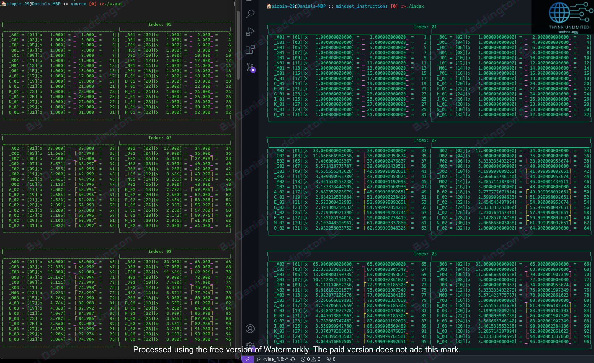
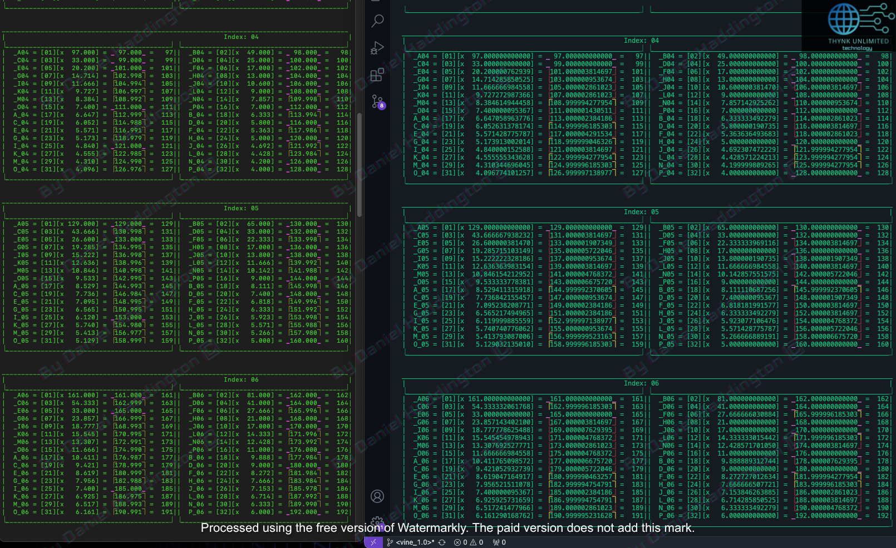
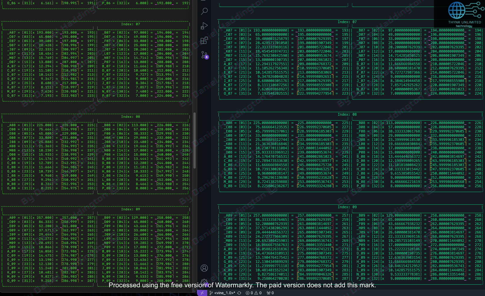
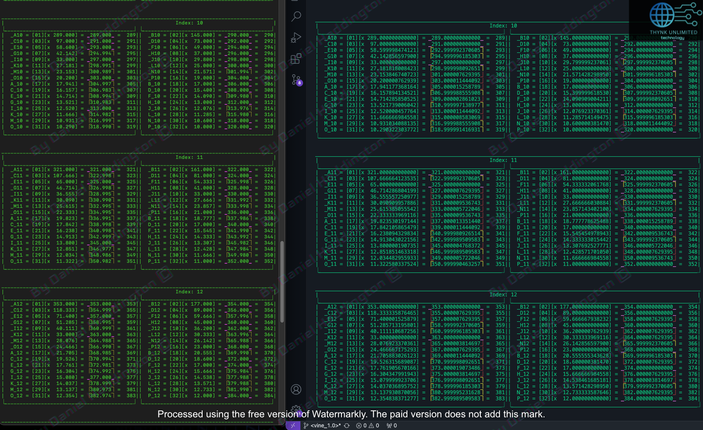
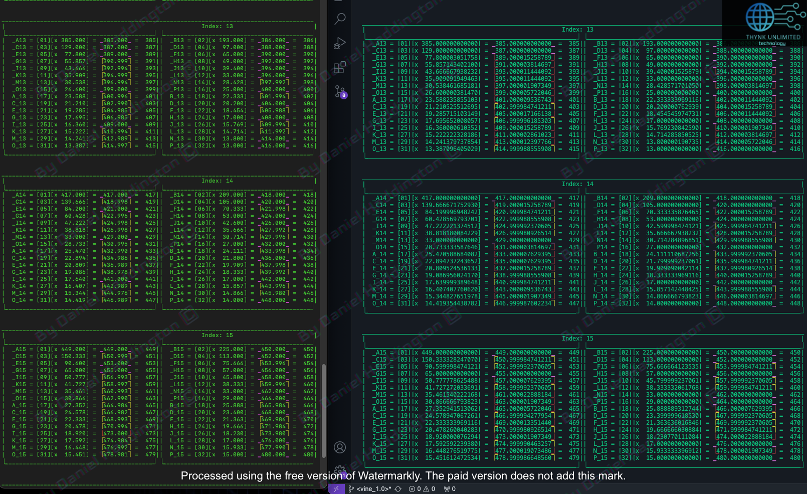
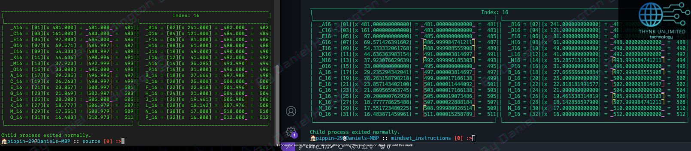

# The 'md' number set system.

<figure><figcaption>
Qset[1], Qset[2], Qset[3]
</figcaption></figure>

<figure><figcaption>
Qset[4], Qset[5], Qset[6]
</figcaption></figure>

<figure><figcaption>
Qset[7], Qset[8], Qset[9]
</figcaption></figure>

<figure><figcaption>
Qset[10], Qset[11], Qset[12]
</figcaption></figure>

<figure><figcaption>
Qset[13], Qset[14], Qset[15]
</figcaption></figure>

<figure><figcaption>
Qset[16]
</figcaption></figure>
