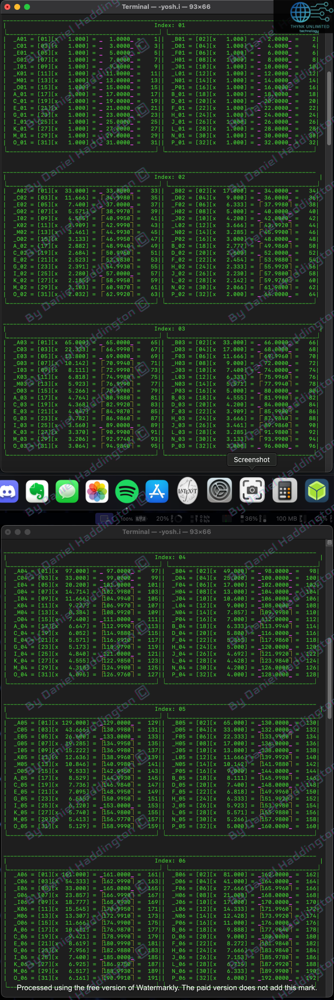
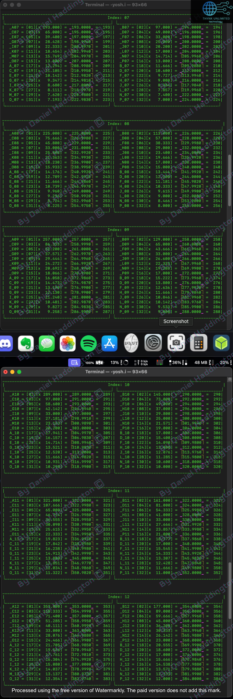
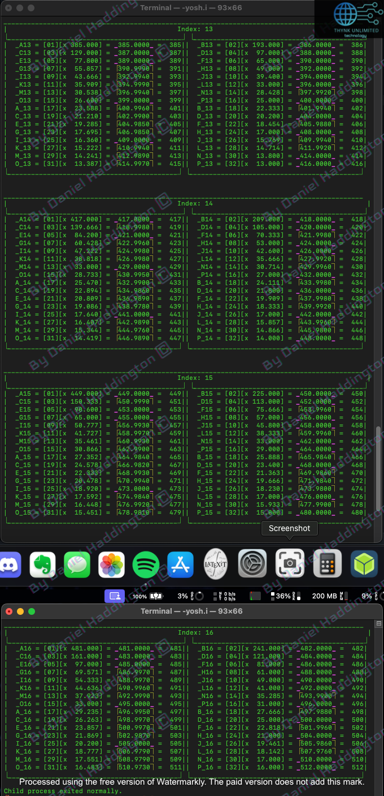

# The MDset\[1] - Qset\[1, 2, 3, 4, 5, 6, 7, 8, 9, 10, 11, 12, 13, 14, 15, 16]

$$
\frac {Value} {Pattern Descriptor} = IndexModifier
$$

$$
\left\lceil \text{ToFloat}\left(\text{DropTail}\left(\text{ToString}\left(IndexModifier\right), 3\right)\right) \times PatternDescriptor \right\rceil
\\=
Value
$$

<figure><figcaption></figcaption></figure>

<figure><figcaption></figcaption></figure>

<figure><figcaption></figcaption></figure>

