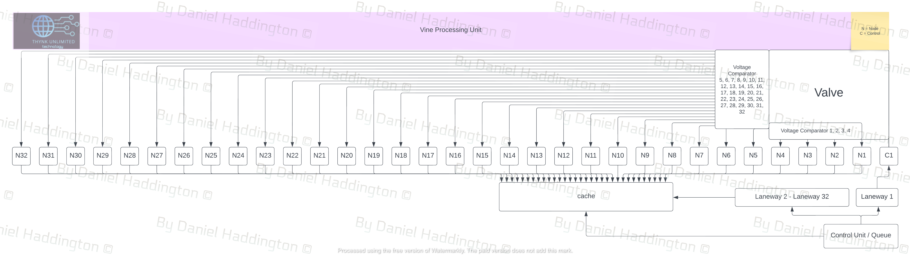

# Vine Processing Unit


<figure><figcaption><p>Vine Processing Unit</p></figcaption></figure>

$$
32! = 263,130,836,933,693,530,167,218,012,160,000,000
$$

$$
32!≈2.63130837×10^{35}
$$

$$
32^{32} = \\
13,507,196,211,763,424,258,704,448,258,491, \\ 329,511,771,545,644,292,456,582,014,229,536
$$

The following instruction can create numbers up to 50 with the integer set: $$Qrange = \begin{bmatrix} 1 & 2 & 3 & ... &32 \end{bmatrix}$$

$$
\begin{array}{l}
\text{Excluding 0} \\
\text{For } n \leq 32, \\
\text{if } n \leq 16, \\ \text{ then } f(n) = n + 16 \\
\text{else } f(n) = n \times 2
\end{array}
\
$$

If instructions sets for a given number do not exist in memory, it may be feasible to create them for further use.

As the number is loaded from a laneway to the cache, it would be crucial that other laneways either have their own cache and are in sync with other laneway-cache loading activity, or the laneways have no ability to 'jump' queue.\
Under this imperative, we could assume that the sequence that the control unit is accessing each location of the 5 bit memory bus within the cache, should be in the sequence that the control unit sent the quantised voltages through the Laneway->Control->Valve->Node?->Cache.

Each Node likely requires an ADC(analog-digital-converter), to be able to set a location within the specialised cache.

Voltage Comparators are used after the Specialised Valve, to make sure that the correct node is being selected.\
\
The control is a preamp, and should be set so that the output of the valve is within range.\
\
As a valve can decline in voltage output over time, it would be necessary to have a reasonable degree of tolerance concerning the voltage pathways selected by the Voltage Comparator Array.\


```
Chat-GPT

While valves can introduce variations to the voltage signal, the extent of this 
variation depends on the specific design and implementation of the valve 
amplifier circuit. In some cases, the harmonic distortion introduced by the 
valve may be desirable, adding warmth or coloration to the signal. However, 
in precision applications where accurate voltage control is required, measures 
may need to be taken to mitigate the effects of valve distortion, such as careful 
circuit design, feedback control, or signal conditioning.

While valves can experience a gradual decline in voltage output with use, the 
rate and extent of this decline depend on factors such as operating conditions, 
maintenance practices, and the specific design and construction of the valve.

```


Circuity protection may be required for each valve, in the case that the valve enters cutoff mode, due to a blocked output, likely caused by falling out of output range (between two voltage comparators, or above the 32nd, or below the 1st).


Numbers can be applied operations, with a sequenced approach, for instance:

A laneway that does not cache in sequence, because it was not directed to do so, would read as a zero.

A zero could be seen by the control unit as a 'negative' or a 'subtraction'.

```
| 0b00000 | 0b00001 | == -1
```

Two zeros in sequence could be seen as a 'positive' or an 'addition'.

```
| 0b00001 | 0b00000 | 0b00000 | 0b00001 | == 2
```

Three zeros in sequence could be seen as a 'division' because numbers are sequenced in a location as a negative.

```
| 0b00010 | 0b00000 | 0b00000 | 0b00000 | 0b00001 | == 2
```

Four Zeros in sequence could be seen as a 'multiplication'

```
| ob11111 | 0b00000 | 0b00000 | 0b00000 | 0b00000 | 0b11111 | == 1024
```

```
| 0b11111 | 0b00000 | 0b00000 | 0b00000 | 0b00000 | 0b11111 |
| 0b00000 | 0b00000 | 0b00000 | 0b00010 | 0b00000 | 0b00001 |

      1024
==  _________
      2 - 1

```

Numbers should not be specified as negative after an addition operation, a subtraction operation must be used.

There may be edge cases with these instructions, as it is till under review, it may be the case that formal mathematical equations are still quite possible, it would just be a case of analysing mathematical syntax for inefficiencies and errors.

It could be a case of adding a digit to indicate a parentheses.

```
| 0b11111 | 0b00000 | 0b00000 | 0b00000 | 0b00000 | 0b11111 |
| 0b00000 | 0b00000 | 0b00000 |
| 0b100011| 0b00000 | 0b00001 |
| 0b100010| 0b00000 | 0b00001 |
| 0b100000|

       1024
==  ___________ == 1024
      - 1 + 2
      
      // 0b100011 - switch two parentheses on via control unit
      // 0b100010 - switch one parentheses off via control unit
      // 0b100000 - switch both parentheses off via control unit
in any case, its just an idea. and i am tired.
```

